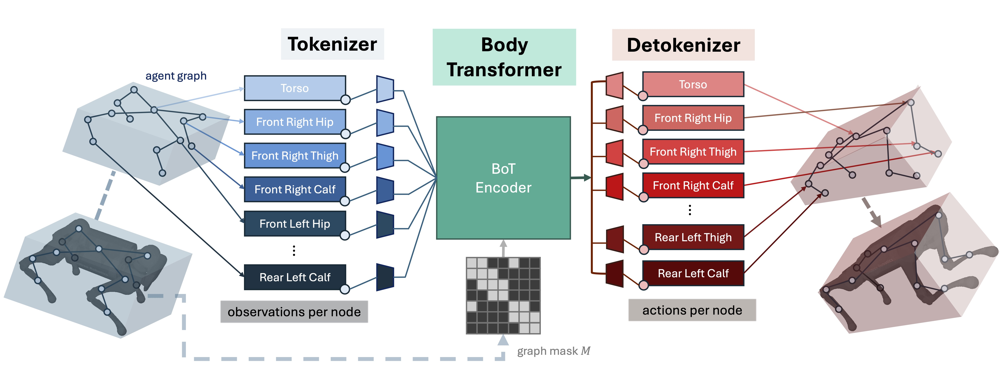

# Body Transformer: Leveraging Robot Embodiment for Policy Learning

[Paper](https://arxiv.org/abs/2408.06316) [Website](https://sferrazza.cc/bot_site/)

Body Transformer (BoT) is an architecture tailored for robot learning, which exhibits better performance in both imitation and reinforcement learning scenarios.



## Summary
Please refer to the corresponding readme files in the subdirectories for more detailed instructions: 
* [Imitation Learning](imitation_learning/README.md)
* [Reinforcement Learning](reinforcement_learning/README.md)
* [Unitree A1 Sim-to-Real](a1_walk/README.md)


## Citation
If you find BoT useful for your research, please cite this work:
```
@article{sferrazza2024body,
  title={Body Transformer: Leveraging Robot Embodiment for Policy Learning},
  author={Sferrazza, Carmelo and Huang, Dun-Ming and Liu, Fangchen and Lee, Jongmin and Abbeel, Pieter},
  journal={arXiv preprint arXiv:2408.06316},
  year={2024}
}
```

## References
This codebase contains some files adapted from other sources:
* Robot Parkour Learning: https://github.com/ZiwenZhuang/parkour
* IsaacGymEnvs: https://github.com/isaac-sim/IsaacGymEnvs
* rl_games: https://github.com/Denys88/rl_games 
* PyTorch: https://github.com/pytorch/pytorch 

